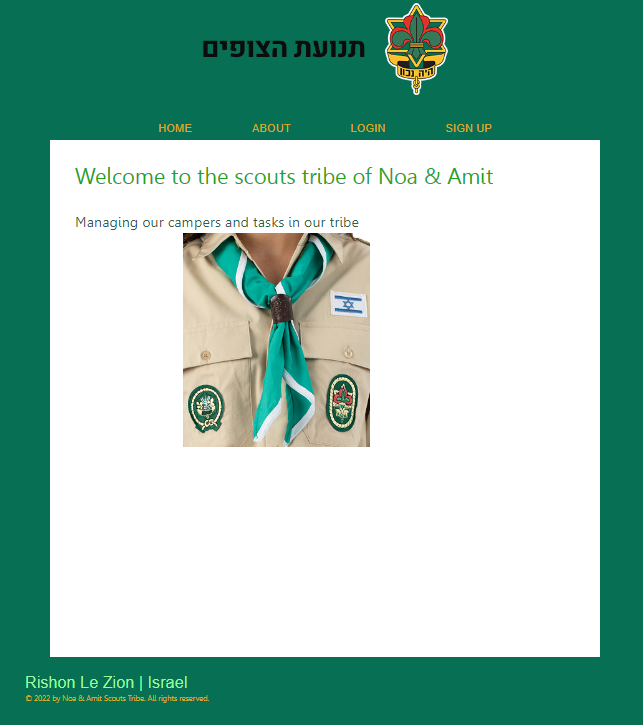
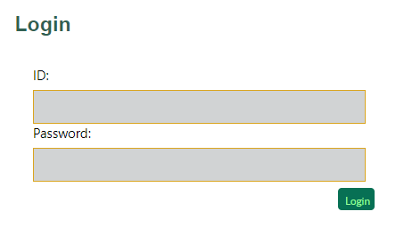
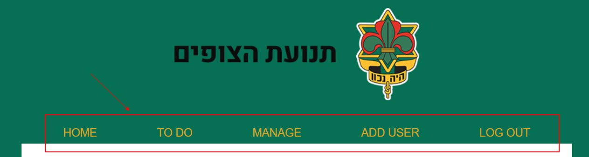
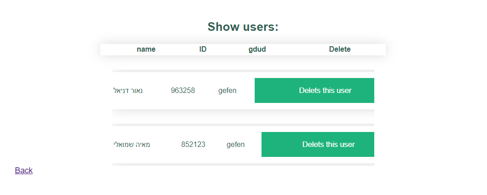
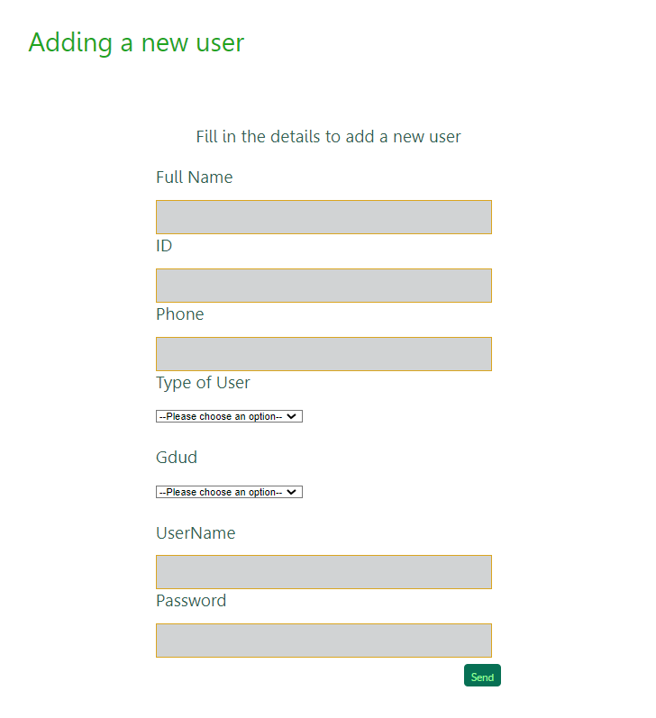
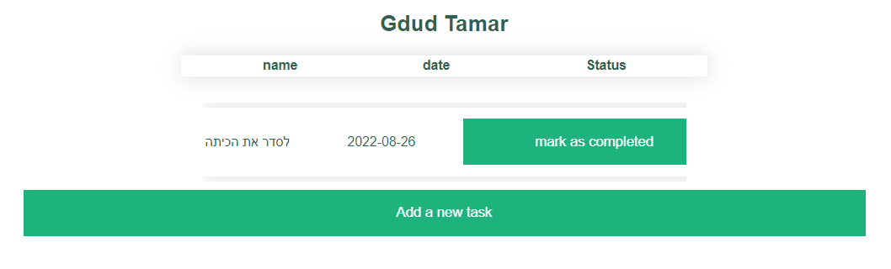
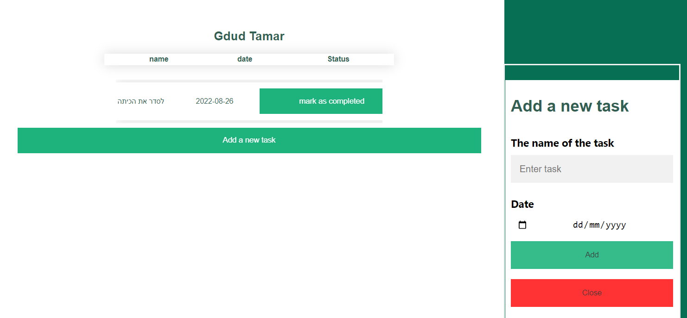
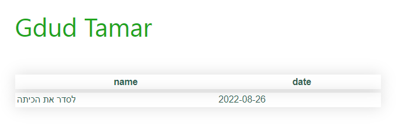

# Scouts tribe

Final project on the website of the Scouts tribe that allowed to manage personnel and tasks. 
In our project there are 2 types of users: admin and camper.
our project start like this :

There are 2 options, first to sign up to a specific gdud if you are new and the second is to log in for existing users.

If an admin has logged in, he goes to the home page of the system administrator, which includes all the functions that only an admin can do, such as edit tasks, seeing the tasks that each Gdud has and closing them if they are done.
Admin can also manage the active users: delete and add new users, whether if they are admins or campers.

The site is based on identities - between a manager and a camper, and if a camper: to which gdud does he belong.
once you click the button you chosed, a table will show all the users of the selected gdud.

For example- gdud Gefen :

*An admin can also manage a table of the active admin (add, delete)

Admins can add users by a form and decide if they are new admins or campers. 
If the new user is a camper, the admin must select a gdud for him.

Tasks managing: admins can see the tasks for each gdud and edit them (create/mark as complited)

For example- gdud Tamar :

If admin wants to add a new task, a form will pop-up for filling the details

Contrasting the admins, campers can only view the tasks without edit them.

